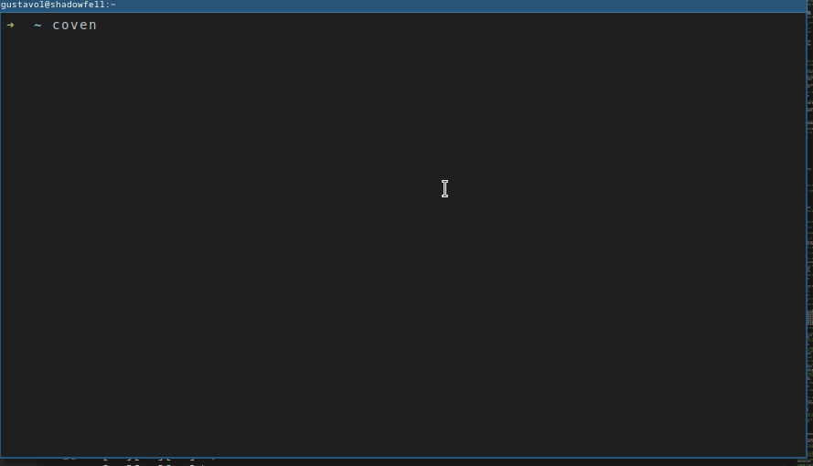

# Coven

A simple command line hex explorer and editor.

This program was inspired by an [awesome video from Low Level Javascript](https://youtu.be/132wDVovzhw).

## Usage

```
$ coven <file>
```



The editor shows three columns - the line addresses in hexadecimal, the bytes, and the ASCII characters of said bytes if one can be printed.
The program paginates the file in 256-byte segments or _pages_, having 16 byte per row and 16 rows.
If there are not enough bytes to fill a page, the page will be padded with zeros.
At the bottom, the editor shows in which age you are and how many pages are left.

Although the program can be used to explore files of any size, _be cautious when editing big files_.
While navigating a file, the editor will only hold the contents of the current page in memory.
As soon as any change is made, even a deletion, a copy of the file with said modifications will be loaded into memory.
In other words, **do not edit files bigger than the available memory you have at the moment**.

### Controls

While in the editor, you can press the `?` key to show the control.

For reference, these are:

#### General

| Key(s) | Action                                                            |
| :----- | :---------------------------------------------------------------- |
| ?      | Help                                                              |
| q      | Quit program (only works in the current file has not been edited) |
| Enter  | Accept change                                                     |
| Esc    | Cancel / Go back to Navigation                                    |

#### Navigation mode

| Key(s)  | Action                                                    |
| :------ | :-------------------------------------------------------- |
| h,j,k,l | Move cursor                                               |
| arrows  | Move cursor (alt)                                         |
| n,p     | Next / Prev. page                                         |
| Home    | First page                                                |
| End     | Last page                                                 |
| w       | Write changes (a prompt for the files path will be shown) |
| u,r     | Undo / Redo                                               |

#### Edit mode

| Key(s)   | Action              |
| :------- | :------------------ |
| arrows   | Select nibble       |
| hex char | Edit current nibble |

#### Insert mode

| Key(s)         | Action                          |
| :------------- | :------------------------------ |
| 0-9, Backspace | Input number of bytes to insert |

#### Delete mode

| Key(s) | Action                                            |
| :----- | :------------------------------------------------ |
| arrows | Increase / Decrease selection of bytes to deleted |

## Installation

This project requires .NET 6 to be built.

First, clone the repo.

```shell
git clone https://github.com/gusaln/coven
cd coven
```

There are two ways to build this project through the `Makefile`: self-contained and not self-contained.
The not self-contained build produces less than 10 files and requires you to have the .NET runtime in the target machine.
The self-contained build is platform specific, is slower, and produces a single executable that includes the .NET runtime and is around between 15 and 20 MB.

### Not self-contained

Run

```
make
```

This will generate the following files:

```shell
# inside build/nosc/
Coven
Coven.deps.json
Coven.dll
Coven.pdb
Coven.runtimeconfig.json
Spectre.Console.dll
```

Your main entry point is the `Coven` file.
It needs to be in the same folder as the other DLLs.
You can create a symbolic link to this file from any place you have in your PATH.
The create-symbolic-link.sh script does this and can be used as a reference.

### Self-contained

You have to choose a platform

```shell
make single-linux-x64
#or
make single-win-x64
```

This will generate the single file executable in a corresponding folder:

```shell
# inside build/single-linux-x64/
Coven
Coven.pdb
```

You can delete de `Coven.pdb` file.
The `Coven` file is your executable.

## Where does the name come from?

Coven as in

> (...) a group or gathering of witches.
> _Wikipedia_ https://en.wikipedia.org/wiki/Coven.

Witches cast hexes.

## License

The MIT License (MIT). Please see [License File](LICENSE) for more information.
